# **Sleep Health and Lifestyle - Exploratory Data Analysis**
  
### Analyzing sleep health and lifestyle data using Pandas, Matplotlib and Seaborn libraries.
### Data available at https://www.kaggle.com/datasets/uom190346a/sleep-health-and-lifestyle-dataset/data

## **Project Goal**
The goal of this project is to analyze the relationship between various aspects of health and lifestyle and sleep quality based on available data. The dataset contains information on various health characteristics, lifestyle, stress levels, physical activity, blood pressure and other health indicators that can affect sleep quality. The project aims to understand how these various factors are related and their importance in improving sleep quality.

The goal of the analysis in the project was:
1. **Understand the impact of demographic and health characteristics on sleep quality:** Checking for correlations between characteristics such as age, resting heart rate, systolic and diastolic blood pressure, BMI, stress level, daily physical activity, and sleep disturbance (or lack thereof) and sleep quality, including analysis of differences in these parameters according to age, gender or occupation.
2. **Analysis of the correlation between the studied characteristics:** Checking correlations not only in relation to the target (sleep quality), but also between different characteristics of each other, concerning lifestyle and health.
3. **Understand the impact of traits on the presence or absence of sleep disorders:** Studying the effects of different intensities of parameters associated with disorders such as insomnia or sleep apnea. The associations of various characteristics with the absence of sleep disorders were also studied.

## **Data**
The dataset is composed as follows:
Total observations of the dataset: 374
Target: Quality of Sleep - subjective rating of the quality of sleep, ranging from 1 to 10.

## **Features analyzed**
* Gender
* Age
* Occupation
* Sleep Duration
* Physical Activity
* Daily Steps
* Stress Level
* BMI Category
* Systolic and Diastolic Blook Pressure (including Blood Pressure Category)
* Heart Rate
* Sleep Disorder

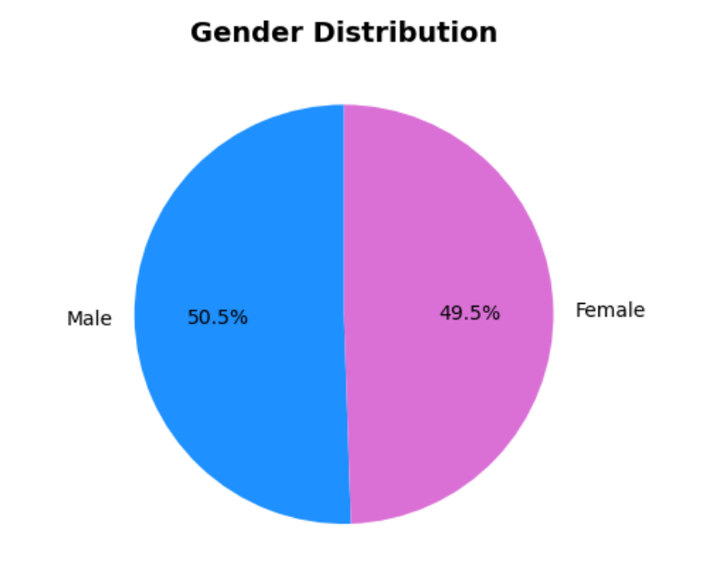
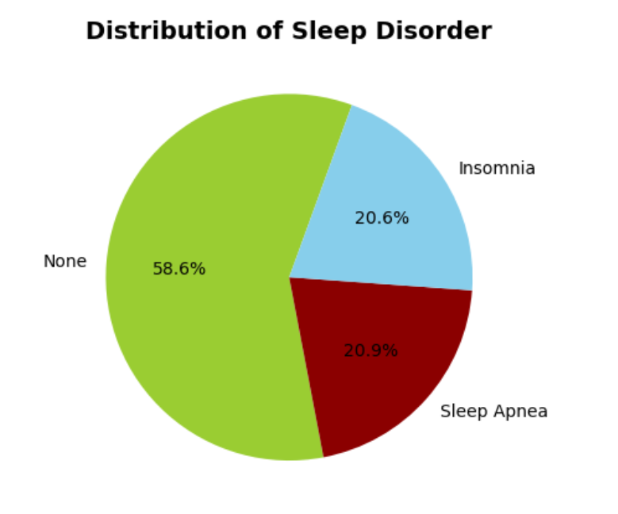

## **Main steps of the analysis**
- **Pre-check metrics, dimension and data types, and check for 'NaN' values in dataframe:** Initial analysis with appropriate functions showing all metrics such as quantity, mean, standard deviation, etc., and the type of each feature.
- **Target analysis - quality of sleep:** Examination of the distribution of values, sleep quality with each disorder (or lack thereof) or sleep quality relative to the age of the subjects.
- **Analysis of each feature:** Examination of feature distributions, calculation of correlations of individual features with the target, examination of the effect of features on other features.
- **Data modification:** Minor modifications were made to the data for better analysis. For example, data type transformation, data filtering, clustering, calculation of metrics, data transformation using apply(), concatenation or de-duplication were applied.
- **Visualization:** During the analysis, visualizations using libraries such as Seaborn and Matplotlib were essential, which created different types of charts to help analyze the data.

## **Results**
**1.** Sleep quality is significantly related to age, sleep duration, stress level and resting heart rate.

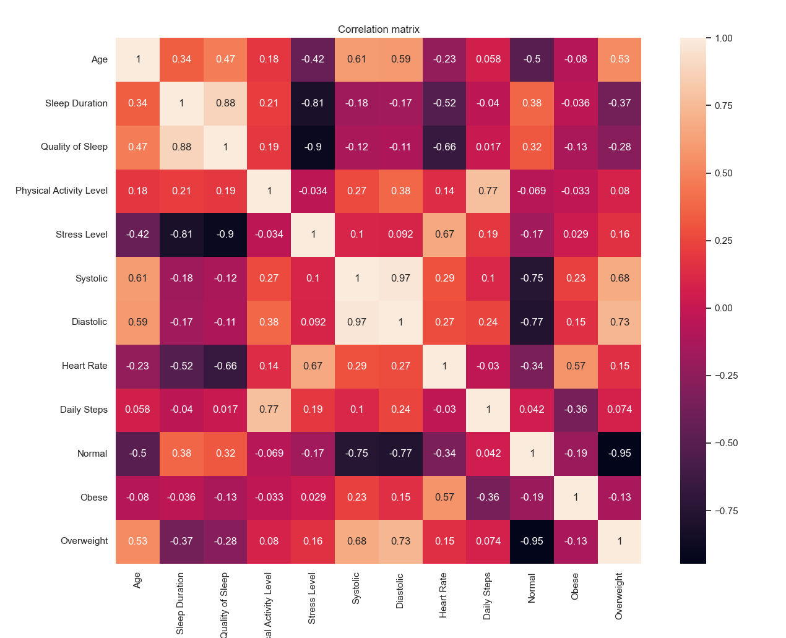

**2.** It can be concluded that sleep quality improves with age, which may be related to less stress and better coping, which is very important because, based on the study, as the amount of stress increased, sleep quality decreased significantly. Older people may also have, for example, an established diurnal rhythm (regular sleep habits), which affects sleep quality.

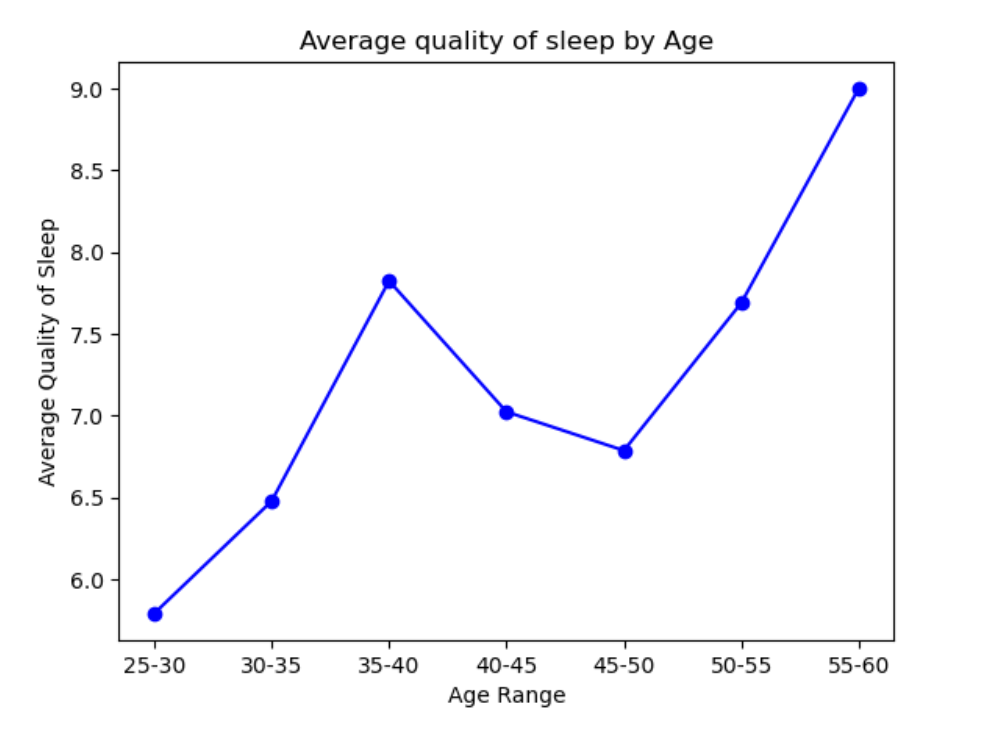

A high correlation between stress levels and age has been observed, which may be due to various factors related to life stages, physiological changes or life experiences. Stress levels are very high in people aged 25-30, because this period of life is associated with key decisions regarding career, relationships, starting a family and financial stability. In the 35-40 age group, stress levels decrease significantly, most likely due to the stabilization of career or personal life and changes in health and lifestyle. In the 45-50 age group, stress levels increase again, due to, for example, challenges related to career (team management) or family challenges such as caring for aging parents, or health problems or initial symptoms of aging. Approaching the age of 60, stress levels decrease significantly, which is associated with retirement, reduced professional responsibility or stabilization of personal and financial life.

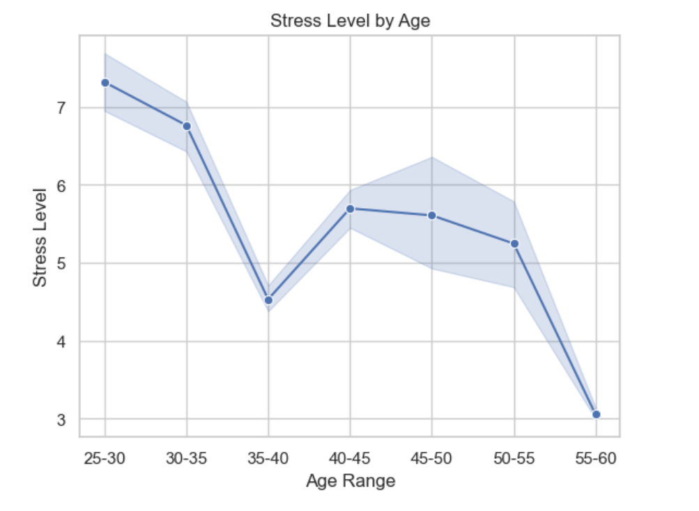

**3.** Based on the analysis of the data, it can also be concluded that sleep length plays a significant role in sleep quality. A significant upward trend was observed here - as the length of sleep increased, so did its quality. Longer sleep allows a person to go through full sleep cycles, which means a person has more opportunities to enter the deep sleep and REM phases. This, in turn, improves the overall quality of sleep, as each sleep phase has an important regenerative function. When sleep duration is too short, a person may not achieve an adequate number of complete sleep cycles, leading to the body not having enough time to regenerate. As a result, this can lead to feelings of fatigue, lowered mood, concentration problems and a weakened immune system.

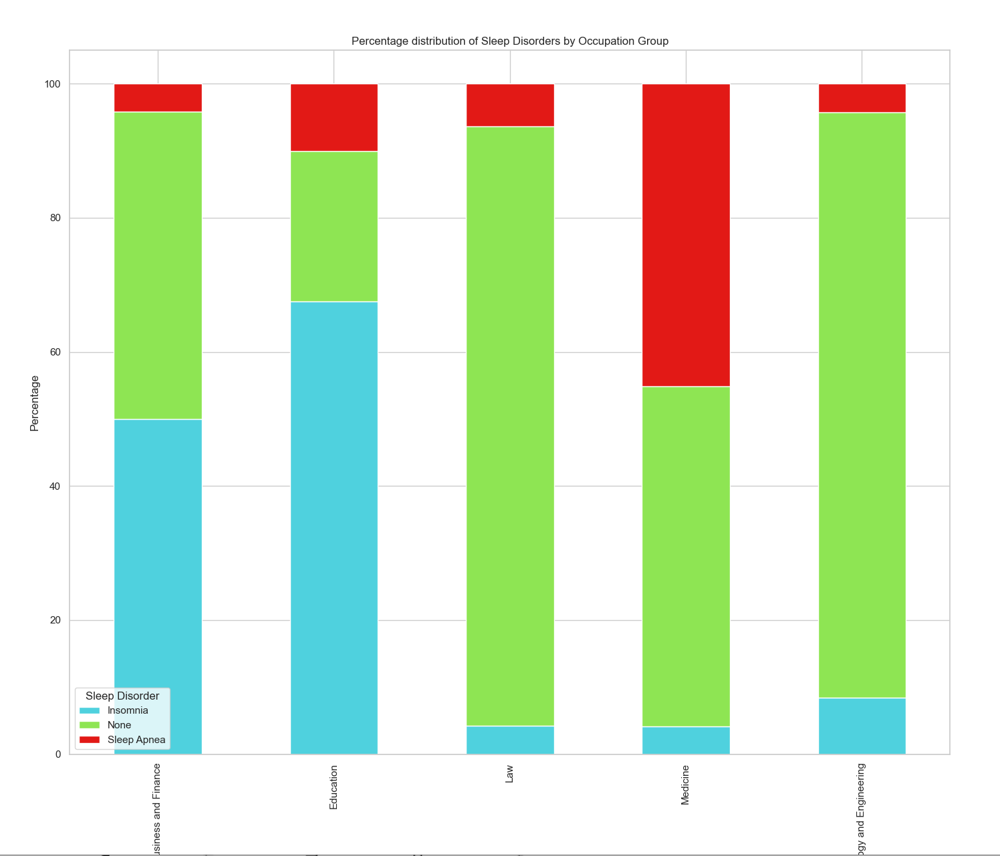

**4.** Stress levels also play a significant role in sleep quality. The higher the level of stress among the subjects, the worse they rated the quality of their sleep. This is most likely due to the high amount of cortisol, a stress hormone produced by the adrenal glands. As a result of elevated cortisol levels, heart rate and blood pressure, among other things, increase. Elevated cortisol negatively affects the diurnal rhythm, which can lead to difficulty falling asleep and sleep disorders.

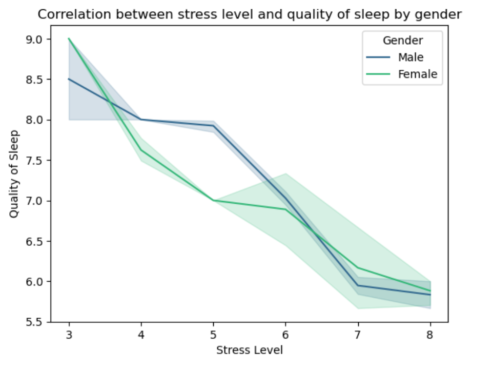

**5.** It was also observed that as resting blood pulse, or the number of heartbeats per minute, increases, sleep quality deteriorates. It usually ranges from 60 to 100 beats per minute in adults. An increase in resting heart rate can be an indicator of stress, malfunctioning of the nervous system, or general weakness of the body. An elevated heart rate can cause problems in going into a relaxed state. In addition, it can lead to shallower sleep phases, meaning that a person is less likely to enter deep sleep phases, such as slow-wave sleep (NREM) or the REM phase, which are crucial for body and mind recovery. People with higher resting heart rates may be more prone to frequent awakenings during the night, resulting in a sense of incomplete rest in the morning.

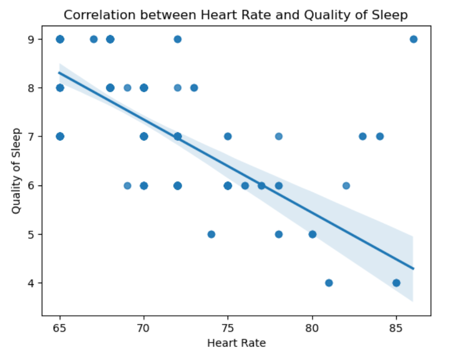
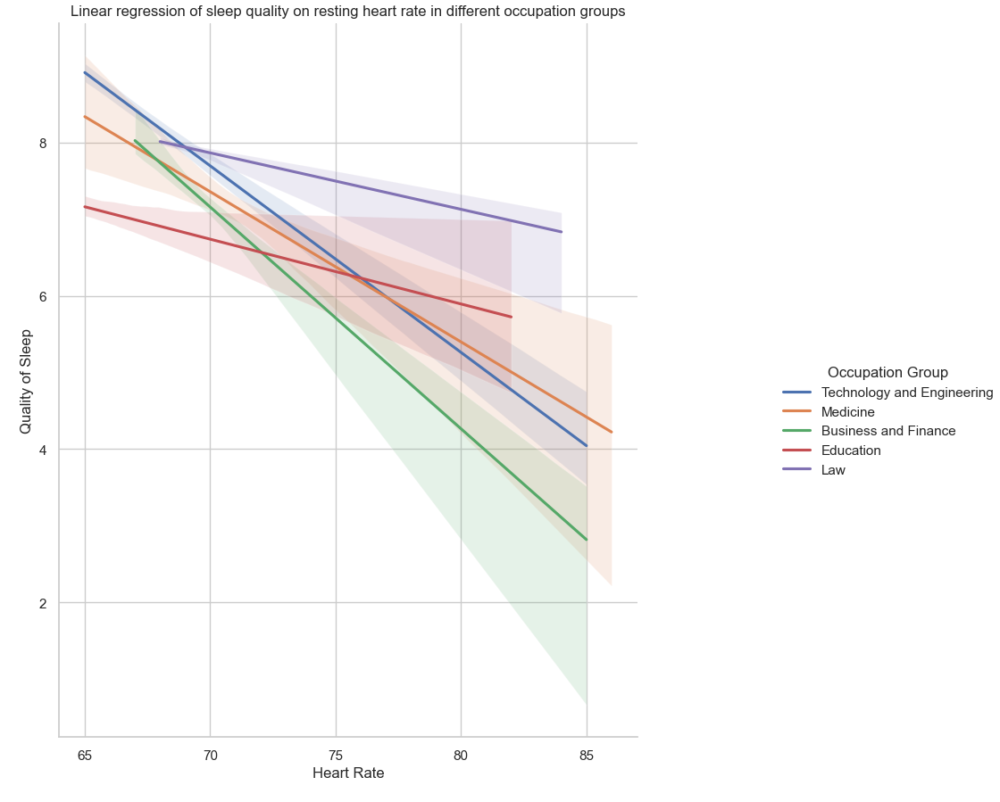

**6.** When studying the prevalence of sleep disorders, it was observed that insomnia was most often suffered by people in the 40-50 age range, which may be related to stressors such as work challenges, family challenges such as raising children, caring for aging parents, and one's own health problems, which increases the risk of developing insomnia. Sleep apnea, on the other hand, was most often suffered by people over 55 years of age and was mainly suffered by women. This may be due to physiological changes, i.e. reduced muscle tension in the throat, while in women, menopause, during which levels of the protective hormones estrogen and progesterone decline, may be a factor in increasing the incidence of sleep apnea.

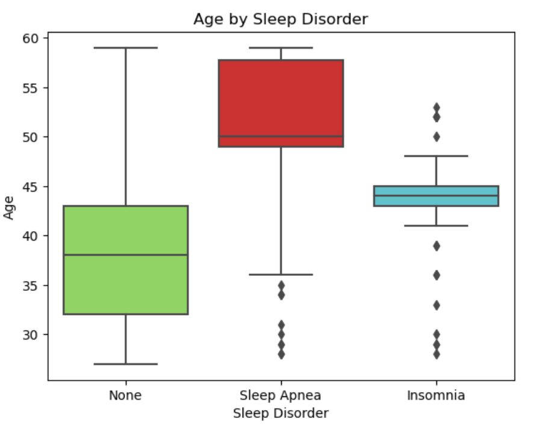
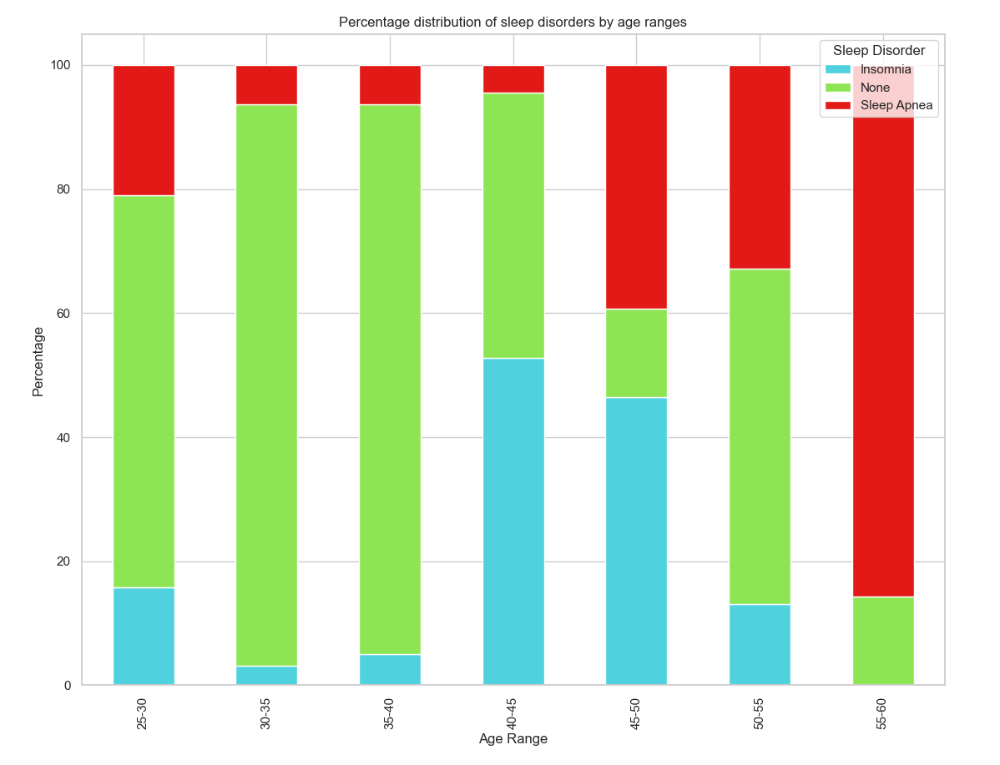
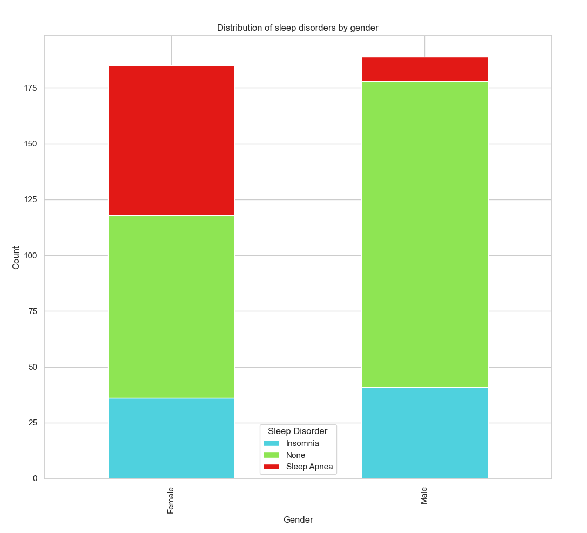

**7.** Insomnia most often affects the Business and Finance and Education sectors. Working in the business and finance sector often involves a lot of stress, due to the pressure to achieve results, manage risks, make decisions under time pressure and have to deal with a lot of responsibility. Stress is one of the main triggers of insomnia, as it can lead to difficulty falling asleep, frequent awakenings during the night and poor sleep quality. Working in education is also associated with high stress, especially among teachers, who have to cope with the demands of teaching, grading students, preparing teaching materials and dealing with students' problems. High intellectual demands can lead to overwork and mental exhaustion, which increases the risk of insomnia.

**8.** Sleep apnea is most commonly suffered by medical workers. Medical workers, especially doctors and nurses, often work shifts, including at night. Working at night can lead to disrupted diurnal rhythms and reduced sleep quality, which increases the risk of sleep apnea, while long working hours can lead to excessive fatigue and affect airway patency during sleep. Working in the medical sector is often associated with high levels of stress due to responsibility for the health and lives of patients and the need to make quick decisions in critical situations. 

**9.** It was observed that among the subjects with a normal BMI, their sleep quality was better, both in women and men. People with a normal BMI are less likely to develop health problems, such as sleep apnea, which can disrupt sleep. A healthier body weight facilitates proper breathing during sleep and reduces the risk of aggravating diseases.

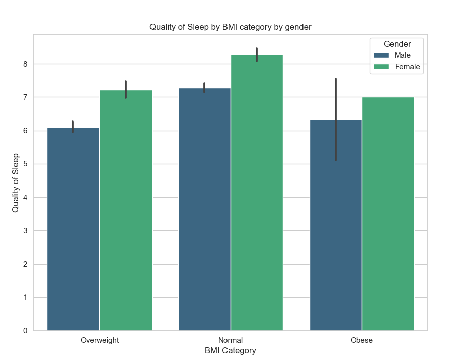

##### In summary, the quality of sleep is significantly higher if it is long enough, which supports the body's regeneration. Additionally, by taking care of a healthy body weight, managing stress, maintaining regular sleep hours and taking care of appropriate physical activity, you can significantly improve its quality and overall well-being.

## **Opportunities for further development of the project**
- **Expand Statistical Analysis:** application of regression, principal component analysis (PCA)
- **Use predictive models:** implementation of decision tree, random forest or neural network models to predict sleep quality based on various features
- **Time and Seasonal Analysis:** study of differences in sleep quality at different times of the year and study of sleep quality over time

